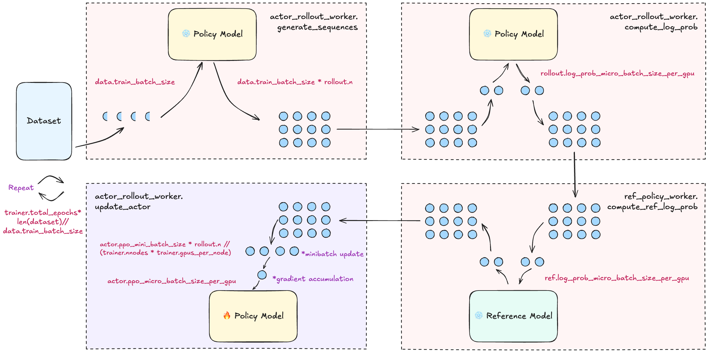

# Group Relative Policy Optimization (GRPO)

In reinforcement learning, classic algorithms like PPO rely on a "critic" model to estimate the value of actions, guiding the learning process. However, training this critic model can be resource-intensive. 

GRPO simplifies this process by eliminating the need for a separate critic model. Instead, it operates as follows:
- Group Sampling: For a given problem, the model generates multiple possible solutions, forming a "group" of outputs.
- Reward Assignment: Each solution is evaluated and assigned a reward based on its correctness or quality.
- Baseline Calculation: The average reward of the group serves as a baseline. 
- Policy Update: The model updates its parameters by comparing each solution's reward to the group baseline, reinforcing better-than-average solutions and discouraging worse-than-average ones.

This approach reduces computational overhead by avoiding the training of a separate value estimation model, making the learning process more efficient. For more details, refer to the original paper [DeepSeekMath: Pushing the Limits of Mathematical Reasoning in Open Language Models](https://arxiv.org/pdf/2402.03300)

## Key Components

- No Value Function (Critic-less): unlike PPO, GRPO does not train a separate value network (critic)
- Group Sampling (Grouped Rollouts): instead of evaluating one rollout per input, GRPO generates multiple completions (responses) from the current policy for each prompt. This set of completions is referred to as a group.
- Relative Rewards: within each group, completions are scored (e.g., based on correctness), and rewards are normalized relative to the group.

## Configuration

Note that all configs containing `micro_batch_size` are used to configure the maximum sample or token count per forward or backward pass to avoid GPU OOMs, whose value should not change algorithmic/convergence behavior.

Despite that many configurations start with the `ppo_` prefix, they work across different RL algorithms in verl, as the GRPO training loop is similar to that of PPO (without critic).



- `actor_rollout.ref.rollout.n`: For each prompt, sample n times. Default to 1. For GRPO, please set it to a value larger than 1 for group sampling.

- `data.train_batch_size`: The global batch size of prompts used to generate a set of sampled trajectories/rollouts. The number of responses/trajectories is `data.train_batch_size * actor_rollout.ref.rollout.n`

- `actor_rollout_ref.actor.ppo_mini_batch_size`: The set of sampled trajectories is split into multiple mini-batches with batch_size=ppo_mini_batch_size for PPO actor updates. The ppo_mini_batch_size is a global size across all workers.

- `actor_rollout_ref.actor.ppo_epochs`: Number of epochs for GRPO updates on one set of sampled trajectories for actor

- `actor_rollout_ref.actor.clip_ratio`: The GRPO clip range. Default to 0.2

- `algorithm.adv_estimator`: Default is gae. Please set it to grpo instead

- `actor_rollout_ref.actor.loss_agg_mode`: Default is "token-mean". Options include "token-mean", "seq-mean-token-sum", "seq-mean-token-mean". The original GRPO paper takes the sample-level loss (seq-mean-token-mean), which may be unstable in long-CoT scenarios. All GRPO example scripts provided in verl uses the default configuration "token-mean" for loss aggregation instead.

Instead of adding KL penalty in the reward, GRPO regularizes by directly adding the KL divergence between the trained policy and the reference policy to the loss:

- `actor_rollout_ref.actor.use_kl_loss`: To use kl loss in the actor. When used, we are not applying KL in the reward function. Default is False. Please set it to True for GRPO.

- `actor_rollout_ref.actor.kl_loss_coef`: The coefficient of kl loss. Default is 0.001.

- `actor_rollout_ref.actor.kl_loss_type`: Support kl(k1), abs, mse(k2), low_var_kl(k3) and full. Appending "+" in the end (e.g., 'k1+' and 'k3+') would apply straight through to employ k2 for unbiased gradient estimation, regardless of the kl value estimation (see https://github.com/volcengine/verl/pull/2953#issuecomment-3162113848 for more details). How to calculate the kl divergence between actor and reference policy. See this blog post for detailed analysis: http://joschu.net/blog/kl-approx.html

## Advanced Extensions

### DrGRPO

[Understanding R1-Zero-Like Training: A Critical Perspective](https://arxiv.org/pdf/2503.20783) claims there's optimization bias in GRPO, which leads to artificially longer responses, especially for incorrect outputs. This inefficiency stems from the way GRPO calculates advantages using group-based reward normalization. Instead, DrGRPO aggregates token-level losses by normalizing with a global constant to eliminate length bias.

Configure the following to enable DrGRPO, with all other parameters the same as GRPO's:

- `actor_rollout_ref.actor.loss_agg_mode`: "seq-mean-token-sum-norm", which turns off seq-dim averaging
- `actor_rollout_ref.actor.use_kl_loss`: Please set it to False for DrGRPO
- `algorithm.norm_adv_by_std_in_grpo`: False, which turns off standard deviation norm

## Reference Example

Qwen2.5 GRPO training log and commands: [link](https://github.com/eric-haibin-lin/verl-data/blob/experiments/gsm8k/qwen2-7b-fsdp2.log)

```bash
bash examples/grpo_trainer/run_qwen3-8b.sh
bash examples/grpo_trainer/run_qwen2_5-3b_gsm8k_grpo_lora.sh
```

For more reference performance, please see https://verl.readthedocs.io/en/latest/algo/baseline.html
